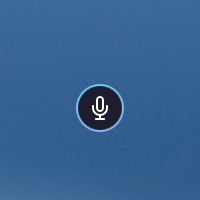

# Integration Examples

## Official Integrations

Hyprwhspr-rs currently ships with three main integrations: a [Hyprland](https://github.com/hyprwm/Hyprland) module, a [Waybar](https://github.com/Alexays/Waybar) module, and a [Walker](https://github.com/abenz1267/walker)/[Elephant](https://github.com/abenz1267/elephant) plugin. These services ship with Omarchy by default, but to support more setups, below you can find the data shape for building your own integrations.

**Status Indicator**

- `${XDG_CACHE_HOME}/hyprwhspr-rs/status.json` (fallback: `/tmp/hyprwhspr-rs/status.json`)
  
  ```jsonc
  {
    // Atomic write: status.json.tmp -> status.json (inotify-friendly).
    // is_recording() => class == "active"
    // shutdown final write: class=inactive, tooltip="Not running"
    "text": "󰍭",              // inactive/error = 󰍭, active/processing = 󰍬
    "tooltip": "Not running", // "Ready" | "Recording..." | "Transcribing..." | "Not running" | "Error: <message>"
    "class": "inactive",      // inactive | active | processing | error
    "alt": "inactive"         // Mirrors class
  }
  ```

**Transcription History**

- `${XDG_DATA_HOME}/hyprwhspr-rs/transcriptions.json` (fallback: `/tmp/hyprwhspr-rs/transcriptions.json`)

  ```jsonc
  [
    // JSON array, newest first.
    // Max entries: 20 (older truncated).
    // Timestamp: "YYYY-MM-DD HH:MM" (local time; UTC fallback).
    {
      "text": "Use NixOS for declarative, reproducible, and reliable system configuration.", // transcription text
      "timestamp": "2026-02-03 14:22" // local timestamp
    },
    {
      "text": "Use the same data in QuickShell.", // transcription text
      "timestamp": "2026-02-03 14:21" // local timestamp
    }
  ]
  ```

## Examples

### Quickshell
[This integration](./quickshell/README.md) shows a floating mic icon in the center of the screen while hyprwhspr is recording.

https://github.com/user-attachments/assets/62d51e4c-1c3f-4774-b33e-5539dc56c91e


